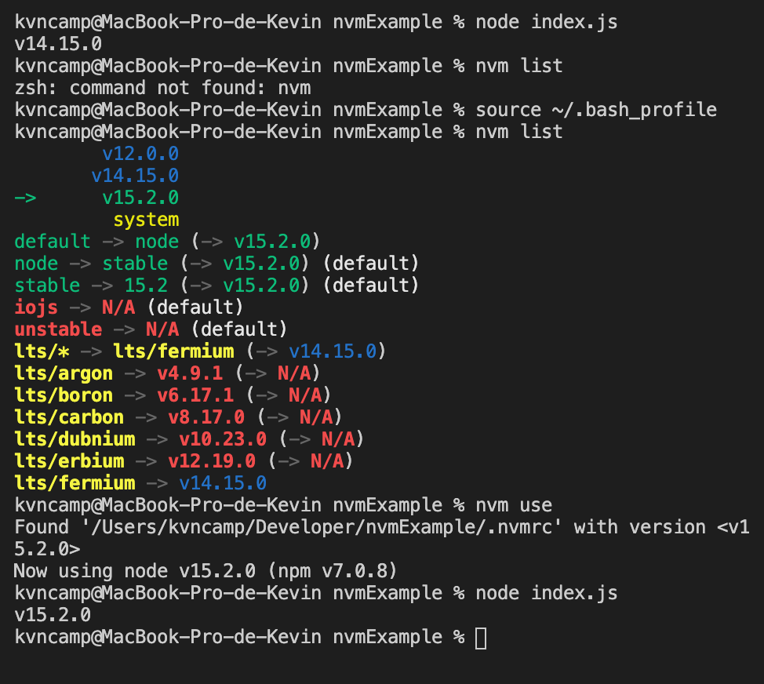
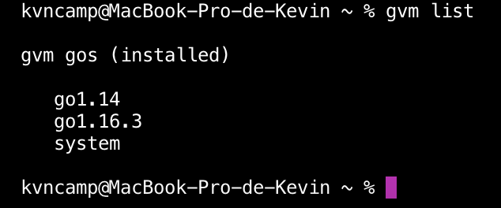

### Tema 2 - Desarrollo basado en pruebas 

## 1. Instalar alguno de los entornos virtuales de node.js (o de cualquier otro lenguaje con el que se esté familiarizado) y, con ellos, instalar la última versión existente, la versión minor más actual de la 4.x y lo mismo para la 0.11 o alguna impar (de desarrollo).

En la plataforma de Mac OS X, la instalación de [nvm](https://github.com/nvm-sh/nvm#installing-and-updating) se la realiza con el siguiente comando desde el terminal.

```
curl -o- https://raw.githubusercontent.com/nvm-sh/nvm/v0.37.0/install.sh | bash
```

Para corroborar que la instalación fue exitosa ejecutamos el comando para en listar las versiones instaladas 

```
nvm list
```

En caso de que exista algun inconveniente como *command not found: nvm*, hay que tener en cuenta que en ciertas versiones de OS X hay ejecutar el comando `source ~/.bash_profile` para actualizar las variables de entorno. Luego de esto nvm estará listo para su uso.

En la siguiente imagen se puede revisar las diferentes versiones instaladas de node. 



--- 
Tambien quise hacer la prueba de entornos virtuales para Go, en la busqueda aparece [gvm](https://github.com/moovweb/gvm), para instalarlo se debe ejecutar el siguiente comando:

```
bash < <(curl -s -S -L https://raw.githubusercontent.com/moovweb/gvm/master/binscripts/gvm-installer)
```

para descargar versiones y agregarlas al entorno ejecutamos el siguiente comando, si deseamos que alguna de ellas sea la versión por defecto se le agrega la etiqueta **--default** una vez que la versión se haya instalado exitosamente.

```
gvm install go1.4
gvm use go1.4 [--default]
```

de igual manera para enlistar las versiones instaladas se ejecuta el comando 

```
gvm list
```

En la siguiente imagen podremos ver las versiones instaladas en este entorno virtual gvm



## 2. Crear una descripción del módulo usando package.json. En caso de que se trate de otro lenguaje, usar el método correspondiente.

Haciendo uso de npm con el comando init hace la creación de nuestro package.json 
`npm init`
Nuestro package.json quedaría de la siguiente forma.


## 3. Descargar el repositorio de ejemplo anterior, instalar las herramientas necesarias (principalmente Scala y sbt) y ejecutar el ejemplo desde sbt. Alternativamente, buscar otros marcos para REST en Scala tales como Finatra o Scalatra y probar los ejemplos que se incluyan en el repositorio.

Para instalar Scala y sbt hay que contar con Java 8 JDK, para verificar que versión se encuentra instalada se ejecuta el comando 
`java -version` o se puede descargar los [binarios de scala](https://downloads.lightbend.com/scala/2.13.4/scala-2.13.4.tgz). 

Para instalar scala se lo realiza mediante [homebrew](https://brew.sh/index_es) el gestor de paquetes para macOS. Ejecutando los siguientes comandos
`brew update`
`brew install scala`
`brew install sbt`

Con esto ya tenemos nuestro ambiente configurado, procedemos a clonar el repositorio para realizar las pruebas `git clone https://github.com/JJ/spray-test.git`.

Luego de tener el ambiente configurado, ejecutar 
`sbt` 
`> test`
Para hacer las pruebas necesarias. En el caso de macOS no esta soportado para BigSur.

## 4. Para la aplicación que se está haciendo para la asignatura, escribir una serie de aserciones y probar que efectivamente no fallan. Añadir tests para una nueva funcionalidad, probar que falla y escribir el código para que no lo haga. A continuación, ejecutarlos desde mocha (u otro módulo de test de alto nivel en el lenguaje que se esté usando), usando descripciones del test y del grupo de test de forma correcta. Si hasta ahora no has subido el código que has venido realizando a GitHub, es el momento de hacerlo, porque lo vamos a necesitar un poco más adelante.

He trabajado en un proyecto hecho con Go, el código se puede encontrar en mi [repositorio](https://github.com/Golang-EC/go-notes).

Hemos utilizado un gestor de tareas *Make*, con una tarea de test, para ponerlo en acción se ejecuta el comando
```
make test
```

En este caso estamos utilizando [assert](github.com/stretchr/testify/assert), una libreria para hacer pruebas de aserciones con go.

Como marco de pruebas estamos utilizando la propia libreria de Go, llamada testing. Para hacer uso de esta libreria ejecutamos el comando 
``` 
go test archivo-test.go
```

Este es el mismo comando que se encuentra dentro de la tarea test dentro del gestor de tareas.