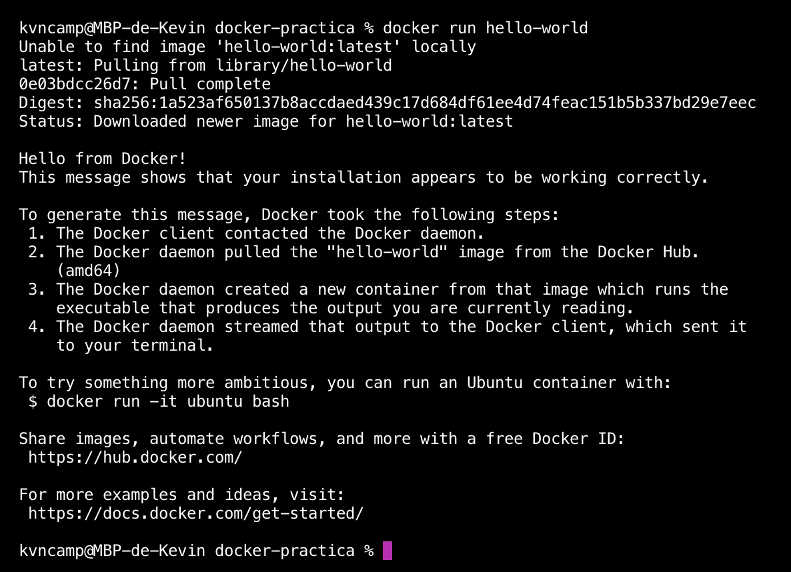
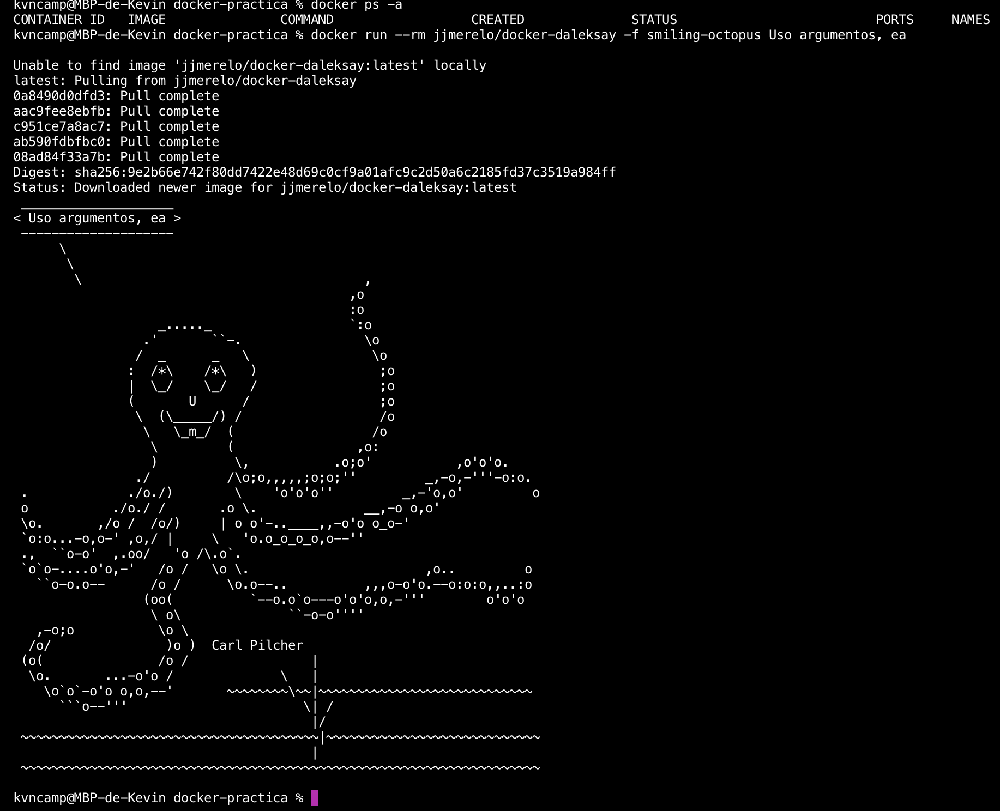
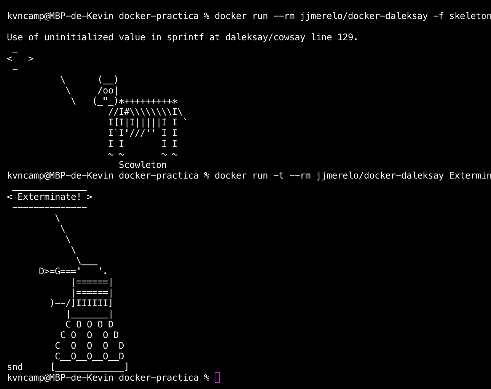
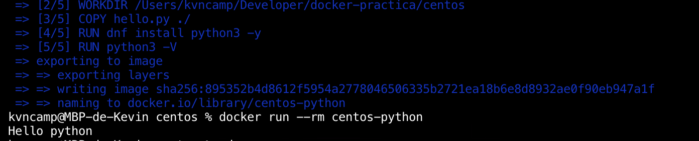
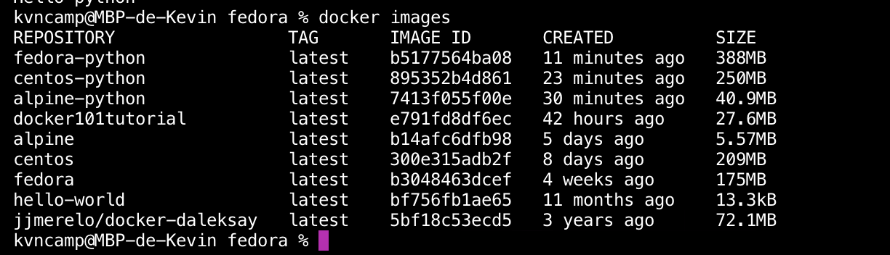
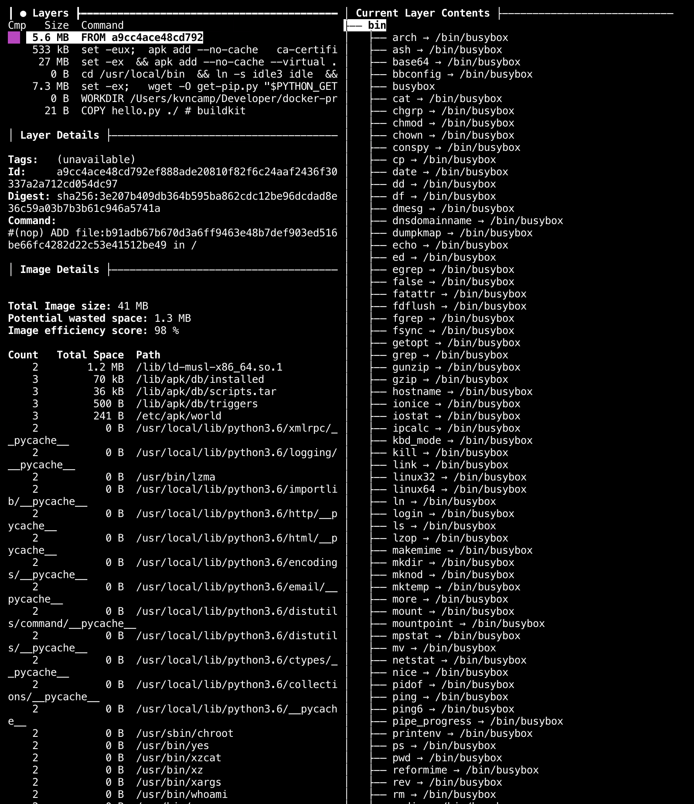

# Tema 3 - Contenedores y cómo usarlos

### 1. Buscar alguna demo interesante de Docker y ejecutarla localmente, o en su defecto, ejecutar la imagen anterior y ver cómo funciona y los procesos que se llevan a cabo la primera vez que se ejecuta y las siguientes ocasiones.
Para empezar a utilizar [Docker](https://www.docker.com) tenemos 2 formas de instalarlo, la primera es mediante [brew](https://brew.sh) y la segunda es descargandolo desde el propio sitio web que nos da su [herramienta de escritorio](https://www.docker.com/products/docker-desktop). En mi caso use la segunda opción por lo que me descargue su herramienta de escritorio.

Para corroborar que todo este correcto, procedemos a ejecutar el siguiente comando en nuestro terminal
`docker run hello-world` esto creara un contenedor y descargará la imagen que corresponde a dicho contenedor, esta imagen ejecuta la función hello y da como resultado el mensaje que se presenta.




Para ser eficientes debemos considerar tener una mínima cantidad de contenedores posibles, solo se deben considerar los contenedores con los cuales se piense trabajar o mantener más adelante. Para hacer practico este uso añade la bandera --rm con lo cual el comando quedaría de la siguiente forma.

`docker run --rm name`



En este caso tenemos como ejemplo una imagen docker de `jjmerelo/dalesy` que encontramos en [Docker Hub](https://hub.docker.com). Este comando remueve el contenedor una vez ejecutada la imagen. En caso de no tener la imagen, se descargará y ejecutará en cuanto la tenga disponible.



### 2.Tomar algún programa simple, “Hola mundo” impreso desde el intérprete de línea de órdenes, y comparar el tamaño de las imágenes de diferentes sistemas operativos base como Fedora, CentOS y Alpine, por ejemplo.

Antes que nada haremos un simple programa en python que imprimirá *Hello python*, es un simple print. El archivo tendrá de nombre **hello.py**.

Para empezar a ejecutar un programa dentro de cada SO que tiene el container debemos de realizar un **Dockerfile**, es un archivo de configuración para la creación de una imagen. En este archivo se da las instrucciones que tiene que seguir para la ejecución del programa dentro de la imagen. 

* Para **Alpine** tenemos el siguien Dockerfile
```
FROM python:3.6-alpine3.11

# se setea el directorio de trabajo
WORKDIR /Users/kvncamp/Developer/docker-practica/alpine

# se copio el programa al directorio raiz
COPY hello.py ./

# coresponde a los comandos a ejecutar
CMD python hello.py
```

* Para **centOS** y **Fedora**, es el siguiente Dockerfile, cabe recalcar que estos SO no cuentan con python instalado por lo que se incluye en las instrucciones la instalación correspondiente. El gestor de paquetes para estos SO es **dfn**.

```
FROM centos:latest

# Directorio de trabajo
WORKDIR /Users/kvncamp/Developer/docker-practica/centos

# Copio el programa 
COPY hello.py ./

RUN dnf install python3 -y

RUN python3 -V

# Comando a ejecutar
CMD python3 hello.py
```

Una vez creado el Docker file correspondiente, tenemos que crear la imagen para esto ejecutamos el comando 
`docker build --no-cache -t python-alpine .`. Lo que hace este comando es hacer un build del archivo Dockerfile, asignando el nombre de la imagen a python-alpine y --no-cache hace que este build siempre empieze desde cero, escribiendo una nueva imagen aun si el archivo Dockerfile no ha cambiado en nada. El punto al final es dado ya que estamos en el mismo directorio en el que se encuentra el archivo Dockerfile, en el caso de que no fuera así, tendriamos que indicar donde se encuentra.

Una vez creadas la imagenes procedemos a ejecutarlas con el comando `docker run -rm python-alpine`, esto ejecuta la imagen y el programa que hemos realizado en cada SO, dando como resultado el print. 
 

**Comparando los tres SO, alpine, fedora y centOS, podemos notar que el que menor peso ocupa es alpine**.


## 3. Crear a partir del contenedor anterior una imagen persistente con commit.
Para crear una imagen persistente, se necesita la IP de la imagen, para obtenerla ejecutamos el comando 
`docker inspect <name-image>` una vez obtenida la imagen ejecutamos `docker commit <IP>`. La imagen creada por ahora no tiene nombre ni etiqueta para agregar un nombre se añade despues del commit indicado quedaría de la siguiente forma `docker commit <IP> <name>`

 

## 4. Examinar la estructura de capas que se forma al crear imágenes nuevas a partir de contenedores que se hayan estado ejecutando.
 

## 5. 